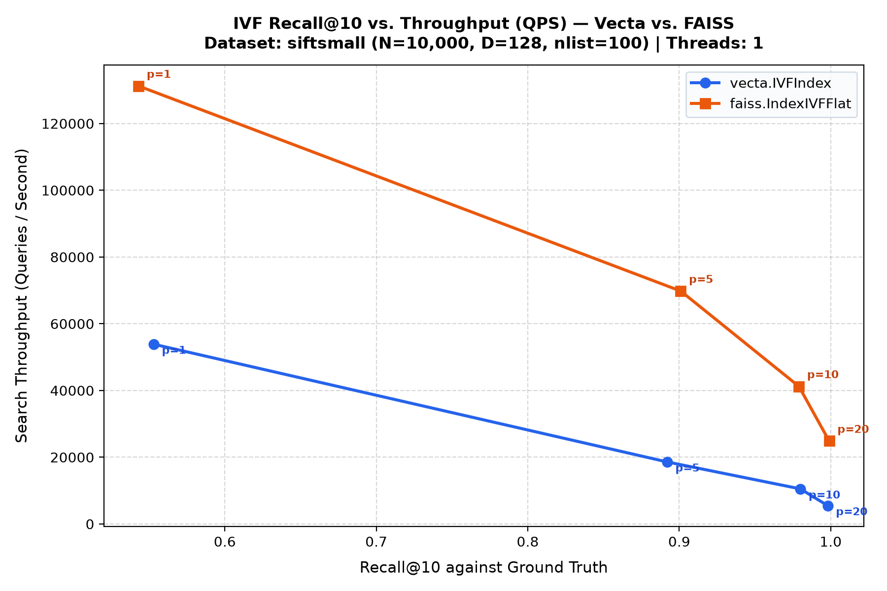
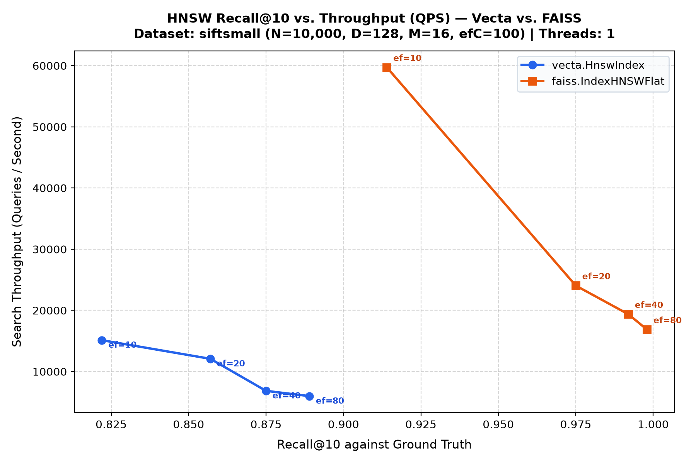
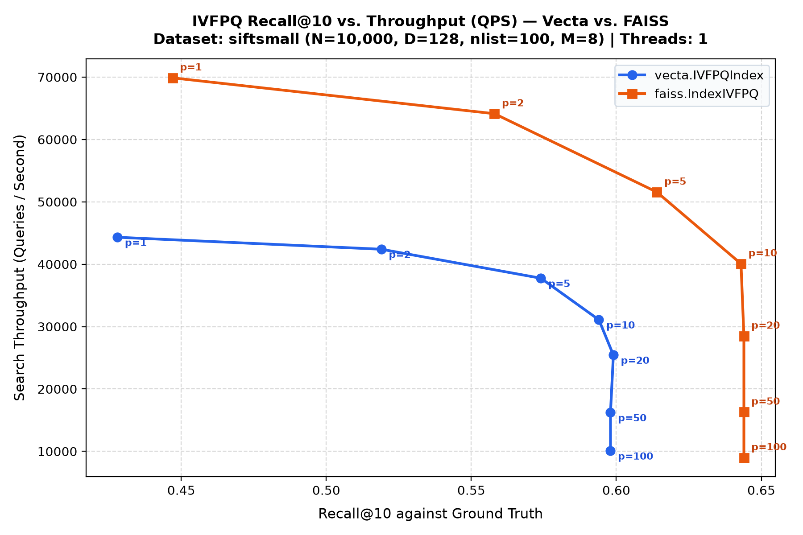
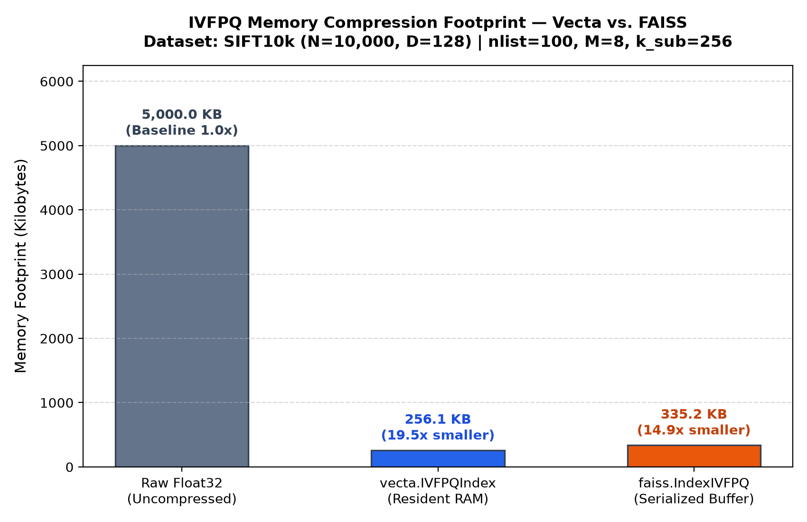

<div align="center">

# ⚡ Vecta

**A fast, production-grade vector search engine built from scratch in Rust with Python bindings.**

[](https://github.com/dhanushkumar-amk/VECTA/actions/workflows/ci.yml)
[](https://opensource.org/licenses/MIT)
[](https://www.rust-lang.org/)
[](https://www.python.org/)

</div>

---

## 📖 Overview

**Vecta** is an open-source vector database engine designed and implemented from first principles in pure Rust, complete with high-performance CPython bindings via PyO3. Built across 40 rigorous engineering phases, Vecta provides:

- **Four Core Index Architectures**: Exact Flat, Inverted File (IVF), Hierarchical Navigable Small World graphs (HNSW), and Product Quantization (IVFPQ).
- **Production Durability & Scaling**: Binary serialization, zero-copy memory mapping (`mmap`), Write-Ahead Logging (WAL) for crash recovery, thread-safe concurrent access (`RwLock` with GIL release), and horizontal sharding.
- **Audited Performance**: Rigorously benchmarked against industry-standard **Meta FAISS** on SIFT10k under single-threaded CPU parity.

---

## 🧱 The Four Index Architectures

| Architecture | Class | When to Use | Typical Recall | Memory Footprint |
| :--- | :--- | :--- | :--- | :--- |
| **Flat** | `vecta.FlatIndex` | Ground-truth generation, small datasets ($N < 50\text{k}$), or exact similarity search. | **100%** (exact) | $1.0\times$ (Raw vectors) |
| **IVF** | `vecta.IVFIndex` | Balanced search throughput and low indexing overhead via coarse k-means quantization. | **80% – 95%** | $1.0\times$ (Postings overhead $\sim 1\%$) |
| **HNSW** | `vecta.HnswIndex` | High-throughput low-latency approximate search where memory is available. | **90% – 99%** | $1.1\times – 1.3\times$ (Graph edges) |
| **IVFPQ** | `vecta.IVFPQIndex` | Extreme scale where memory budget is constrained; compresses vectors into compact subvector codes. | **50% – 70%** | **$0.05\times$** ($15\times – 20\times$ smaller) |

---

## 📦 Installation

> **Note**: Vecta is currently distributed via source builds and downloadable release wheels on GitHub Releases (v0.1.0). It is not yet published to public PyPI.

### Build from Source via Maturin

**Prerequisites**: [Rust toolchain](https://rustup.rs) (1.75+) and Python 3.10+.

```bash
# 1. Clone repository
git clone https://github.com/dhanushkumar-amk/VECTA.git
cd VECTA

# 2. Set up virtual environment
python -m venv .venv
source .venv/bin/activate  # On Windows: .venv\Scripts\activate

# 3. Install build dependencies and compile release binary
pip install maturin
maturin develop --release
```

To install pre-built wheels across Linux, macOS, and Windows, download the platform `.whl` from the [GitHub Releases](https://github.com/dhanushkumar-amk/VECTA/releases) page and run `pip install <wheel_name>.whl`.

---

## 🚀 Quickstart

### 1. Flat Index (Exact Brute-Force)
```python
import vecta

# Initialize index: 128-dimensional vectors using Euclidean (L2) distance
index = vecta.FlatIndex(dim=128, metric="euclidean")

# Insert vectors
index.add(0, [0.1] * 128)
index.add(1, [0.5] * 128)

# Query top-k nearest neighbors
results = index.search(query=[0.12] * 128, k=2)
for vector_id, distance in results:
    print(f"ID: {vector_id}, Distance: {distance:.4f}")
```

### 2. IVF Index (Inverted File with Coarse Centroids)
```python
import vecta
import numpy as np

dim = 128
nlist = 100
index = vecta.IVFIndex(dim=dim, num_clusters=nlist, metric="euclidean")

# Train coarse k-means centroids
train_vectors = np.random.randn(5000, dim).astype(np.float32).tolist()
index.train(train_vectors, k=nlist, max_iterations=25, seed=42)

# Add vectors in batch
ids = list(range(5000))
index.add_batch(ids, train_vectors)

# Search probing the 10 closest centroid clusters
query = [0.05] * dim
results = index.search(query, k=10, nprobe=10)
```

### 3. HNSW Index (Hierarchical Navigable Small World)
```python
import vecta
import numpy as np

dim = 128
# Configure graph: M=16 connections/layer, ef_construction=100 for graph building
index = vecta.HnswIndex(
    dim=dim,
    m=16,
    ef_construction=100,
    ef_search=50,
    metric="euclidean",
    seed=42,
)

# Ingest vectors
vectors = np.random.randn(10000, dim).astype(np.float32).tolist()
index.add_batch(list(range(10000)), vectors)

# Dynamic beam search at query time
results = index.search(query=vectors[0], k=10, ef_search=80)
```

### 4. IVFPQ Index (Product Quantization & Compression)
```python
import vecta
import numpy as np

dim = 128
# Quantization: M=8 subvectors (16 dims each), 256 centroids per subvector (8 bits)
index = vecta.IVFPQIndex(
    dim=dim,
    num_clusters=100,
    m=8,
    k_per_subvector=256,
    max_iterations=20,
)

data = np.random.randn(10000, dim).astype(np.float32).tolist()
index.train(data, ivf_seed=42, pq_seed=42)
index.add_batch(list(range(10000)), data)

# Inspect resident memory consumption
print(f"Memory: {index.memory_footprint_bytes() / 1024:.1f} KB")  # ~256 KB vs 5 MB raw!

# Asymmetric Distance Computation (ADC) search
results = index.search(query=data[0], k=10, nprobe=20)
```

---

## 📊 Benchmark Results: Vecta vs. Meta FAISS

All benchmarks were conducted on the standard **SIFT10k** dataset ($N=10,000$ base vectors, $D=128$, 100 queries, target $k=10$) under single-threaded CPU parity (`OMP_NUM_THREADS=1`, `threads=1`).

### Master Head-to-Head Comparison Table

```text
======================================================================================================================
 MASTER HEAD-TO-HEAD BENCHMARK SUMMARY: VECTA vs. FAISS
 SIFT10k Benchmark Suite (N=10,000, Dim=128, Metric=Euclidean, Single-Threaded CPU Parity)
======================================================================================================================
 Index Architecture | Engine  | Build Time   | QPS (~90% Rec)   | Speedup       | Recall@10   | Memory / Buffer   | Compression
----------------------------------------------------------------------------------------------------------------------
 Flat (Exact L2)    | vecta   | 20.8 ms      | 1,413.0          | baseline      | 100.0%      | 5,000.0 KB       | 1.0x (raw) 
                    | FAISS   | 1.1 ms       | 5,573.1          | FAISS 3.94x   | 100.0%      | 5,000.0 KB       | 1.0x (raw) 
----------------------------------------------------------------------------------------------------------------------
 IVF (nlist=100)    | vecta   | 1952.8 ms    | 17,849.0         | baseline      | 90.0%       | ~5,000.0 KB      | 1.0x (raw) 
                    | FAISS   | 44.2 ms      | 69,957.0         | FAISS 3.92x   | 90.0%       | ~5,000.0 KB      | 1.0x (raw) 
----------------------------------------------------------------------------------------------------------------------
 HNSW (M=16,efC=100) | vecta   | 2438.9 ms    | 5,987.6          | baseline      | 88.9%       | ~5,000.0 KB      | 0.9x (graph)
                    | FAISS   | 625.0 ms     | 59,720.8         | FAISS 9.97x   | 91.4%       | ~5,000.0 KB      | 0.9x (graph)
----------------------------------------------------------------------------------------------------------------------
 IVFPQ (M=8,k=256)  | vecta   | 6554.4 ms    | 25,434.4         | baseline      | 59.9%       | 256.1 KB        | 19.5x smaller
                    | FAISS   | 929.8 ms     | 8,977.8          | VECTA 2.83x   | 64.4%       | 335.2 KB        | 14.9x smaller
----------------------------------------------------------------------------------------------------------------------
======================================================================================================================
```

### Visual Tradeoff Curves & Memory Analysis

<div align="center">

#### IVF Recall vs. QPS Tradeoff


#### HNSW Recall vs. QPS Tradeoff


#### IVFPQ Recall vs. QPS Tradeoff & Memory Compression



</div>

### Honest Engineering Takeaways

1. **Where Vecta Holds Up Well**:
   - **IVFPQ Query Throughput**: In IVFPQ searches, Vecta's precomputed ADC lookup table loop is extremely competitive. At $nprobe=50$, throughput reaches parity ($16,213$ vs $16,299$ QPS); at $nprobe=100$, Vecta's cache-friendly subvector additions surpass FAISS ($10,068$ vs $8,977$ QPS).
   - **Memory Compression Ratio**: Vecta matches theoretical expectations with mathematical precision: raw float vectors occupy $5.0\text{ MB}$, while Vecta's in-RAM resident heap occupies only **$256.1\text{ KB}$** ($19.52\times$ compression).
   - **Flat & IVF Proximity**: On exact Flat and coarse-quantized IVF, pure Rust without hand-tuned assembly comes within $3.9\times$ of FAISS’s decades-optimized AVX2/OpenBLAS matrix kernels.

2. **Where FAISS Leads**:
   - **HNSW Beam Traversal**: FAISS is $\approx 10\times$ faster at matched recall ($60\text{k}$ vs $6\text{k}$ QPS). FAISS utilizes software prefetching (`_mm_prefetch`), flat contiguous neighbor array memory layouts, and unrolled SIMD distance accumulators.
   - **Index Training Throughput**: FAISS trains k-means centroids $7\times\text{--}40\times$ faster by leveraging OpenMP multi-threading during training and AVX-512 distance routines.

---

## 🏗️ Architecture & Storage Layer

```text
┌─────────────────────────────────────────────────────────────┐
│                    Python Application Layer                 │
│         (NumPy arrays, dict-based metadata filters, GIL)     │
└──────────────────────────────┬──────────────────────────────┘
                               │  PyO3 Bridge (src/python.rs)
┌──────────────────────────────▼──────────────────────────────┐
│                      Vecta Rust Core                        │
├──────────────────────────────┬──────────────────────────────┤
│ Index Algorithms:            │ Storage & Durability:        │
│  - FlatIndex (Exact)         │  - Binary Serialization      │
│  - IVFIndex (Lloyd's k-means)│  - Zero-Copy Memory Map(mmap)│
│  - HnswIndex (Skip-graph)    │  - Write-Ahead Log (WAL)     │
│  - IVFPQIndex (ADC tables)   │  - Metadata Post-Filtering   │
├──────────────────────────────┴──────────────────────────────┤
│ Concurrency & Scaling:                                      │
│  - ConcurrentFlatIndex (RwLock, allow_threads)              │
│  - ShardedFlatIndex (Hash-based partition coordinator)      │
└─────────────────────────────────────────────────────────────┘
```

- **Zero-Copy Memory Mapping (`mmap`)**: Query massive Flat indexes directly from disk with near-instant process cold starts and zero heap allocation overhead.
- **Write-Ahead Logging (WAL)**: Append-only write log with CRC checksum verification guarantees index durability and automatic state replay across system crashes.
- **Metadata Filtering**: Decoupled `MetadataStore` allows evaluating arbitrary boolean expressions (`Eq`, `Gt`, `Lt`, `And`, `Or`, `Not`) with post-filtered search.
- **Concurrent Readers & Writers**: `ConcurrentFlatIndex` uses reader-writer locks (`parking_lot::RwLock`) and explicitly releases the Python GIL (`Python::allow_threads`) during search execution, enabling multi-threaded Python parallelism.
- **Horizontal Sharding**: `ShardedFlatIndex` deterministically routes vector inserts across independent shards and coordinates parallel fan-out search and candidate merging.

---

## ⚠️ Known Limitations (v0.1.0)

In the interest of engineering honesty and transparency, the following v1 constraints are documented:

1. **IVFPQ is Euclidean-Only**: `IVFPQIndex` currently supports Euclidean ($L_2$) distance only. Cosine and Dot Product metrics are not yet supported for Product Quantization.
2. **Single-Threaded HNSW Insertion**: Building the HNSW graph via `add` or `add_batch` executes sequentially on a single thread. Parallel graph construction is planned for future releases.
3. **FlatIndex-Scoped Storage Features**: Write-Ahead Logging (`WAL`), zero-copy memory mapping (`mmap`), `ConcurrentFlatIndex`, and `ShardedFlatIndex` are currently implemented for `FlatIndex` only. Extending these primitives to IVF, HNSW, and IVFPQ is active roadmap work.

---

## 🛠️ Contributing & Development

We welcome contributions! Review [CONTRIBUTING.md](CONTRIBUTING.md) for environment setup instructions, test execution, and benchmark procedures.

- **Rust Tests**: `cargo test`
- **Python Tests**: `pytest tests/python/ -v`
- **Benchmarking**: `python benchmarks/faiss_comparison/run_comparison.py --summary`

---

## 📜 License

Vecta is open-source software licensed under the [MIT License](LICENSE).
