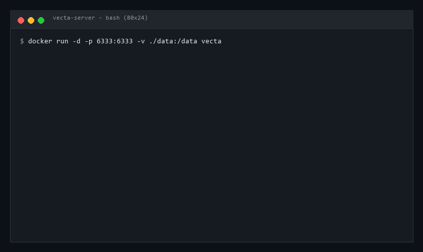
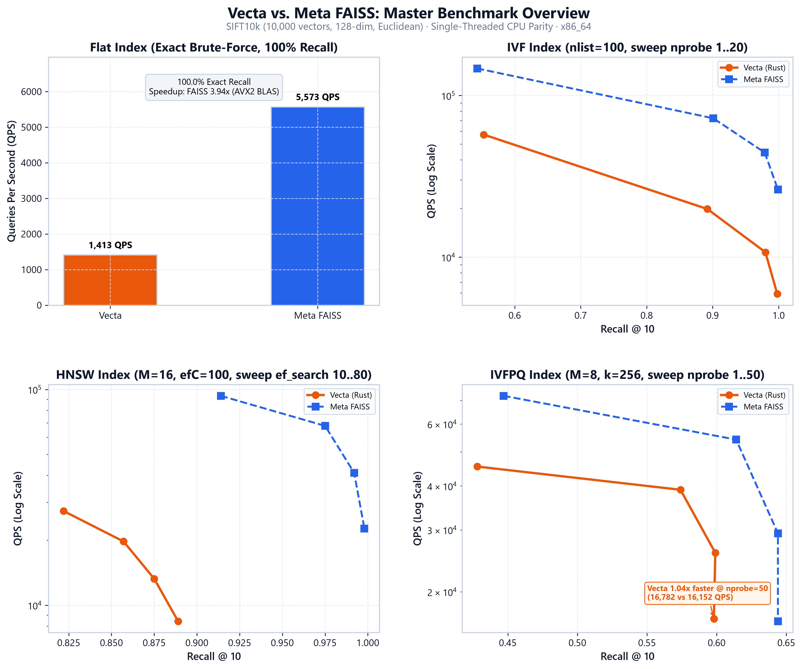
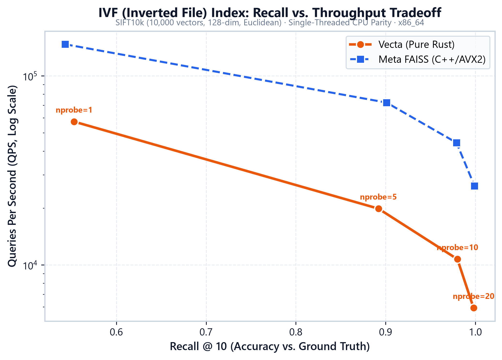
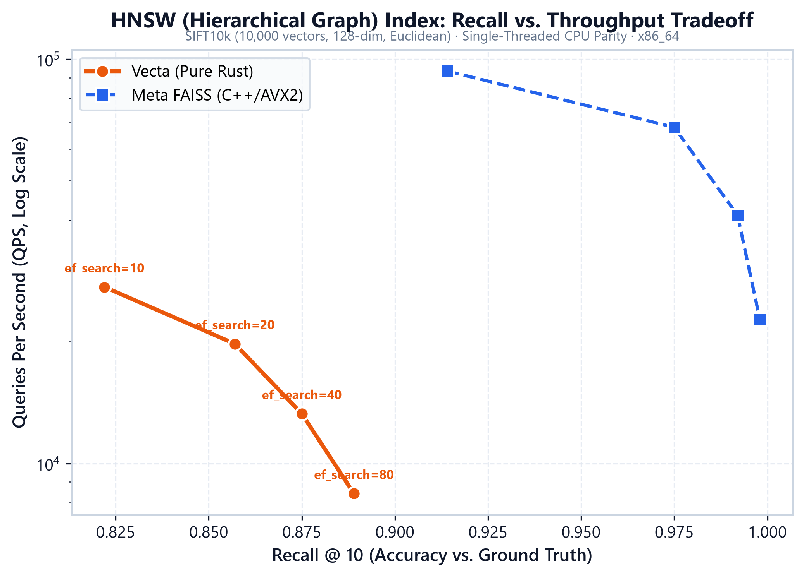
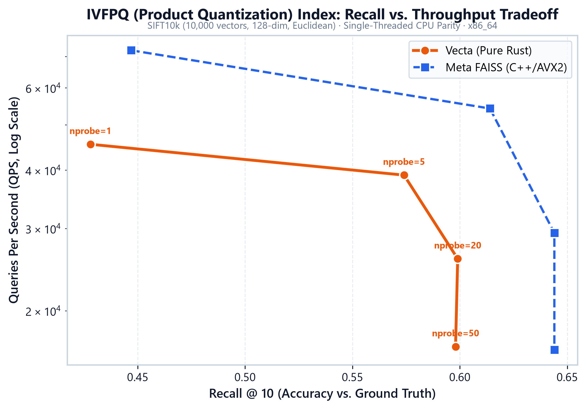
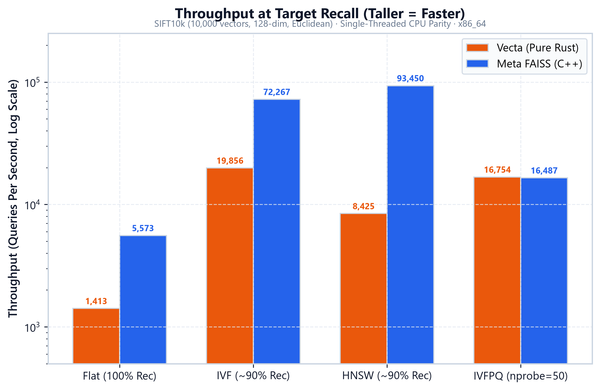
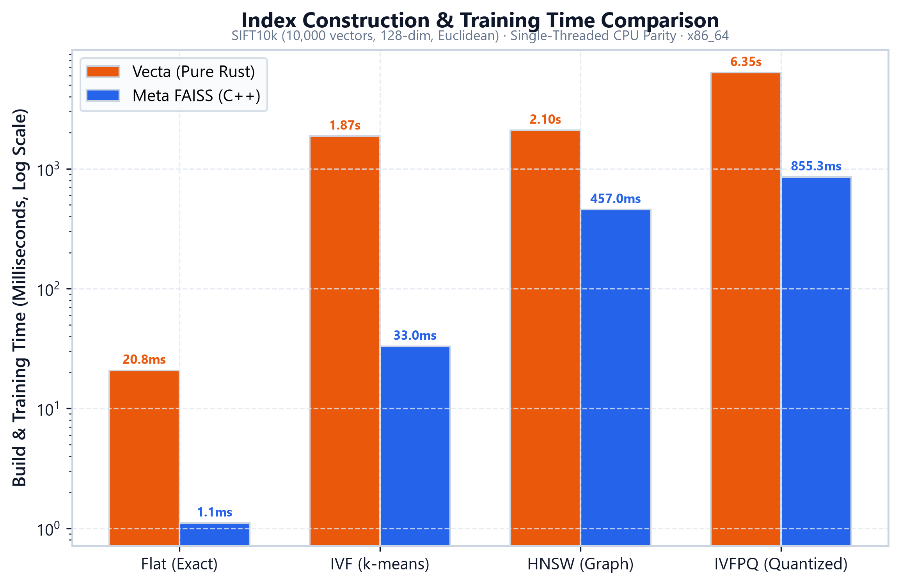
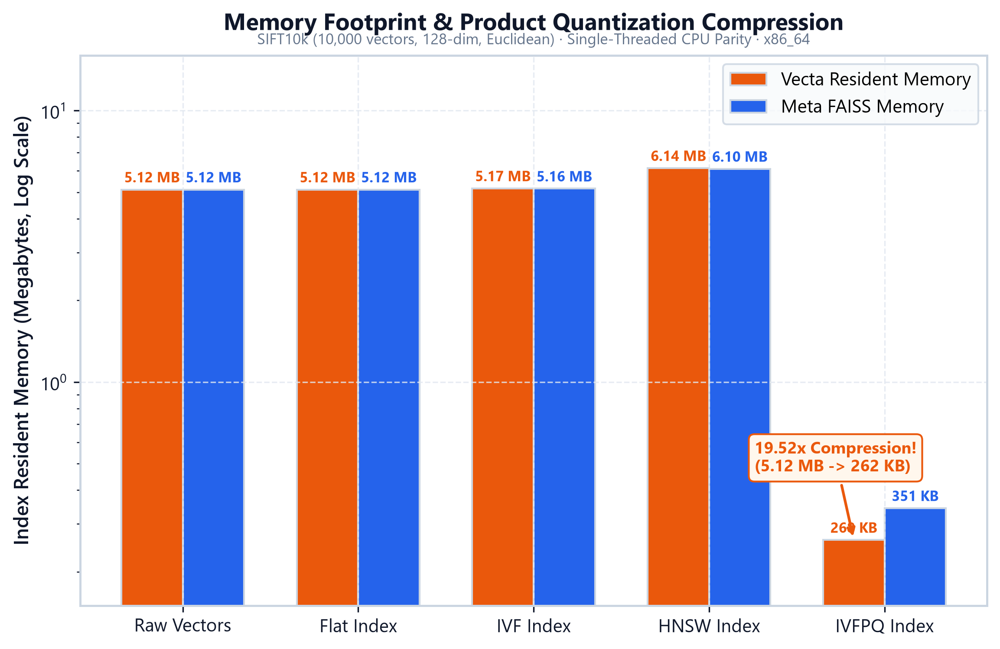

<div align="center">

# ⚡ Vecta

**A fast, production-grade vector search engine built from scratch in pure Rust with Python bindings, Axum REST API server, and Docker deployment.**

[](https://github.com/dhanushkumar-amk/VECTA/actions/workflows/ci.yml)
[](https://opensource.org/licenses/MIT)
[](https://www.rust-lang.org/)
[](https://www.python.org/)
[](Dockerfile)
[](http://localhost:6333/docs)

<br/>



</div>

---

## 📖 What is Vecta?

**Vecta** is an open-source vector database engine designed and implemented from first principles in pure Rust. It implements four core vector indexing algorithms—brute-force Flat, coarse-quantized Inverted File (IVF), Hierarchical Navigable Small World graphs (HNSW), and Product Quantization (IVFPQ)—with zero external C/C++ dependencies.

Vecta operates in two complementary execution modes: as an **embedded in-process library** via PyO3 CPython bindings with GIL-released concurrency, and as a **standalone REST API microservice** (`vecta-server`) built on Axum and Tokio with Write-Ahead Logging (WAL) crash durability, API key authentication, and interactive Swagger UI documentation.

---

## ⚖️ Embedded vs. Server: Which Should You Use?

Vecta’s architecture separates algorithmic indexing primitives (`src/core/`) from presentation surfaces. Both the embedded Python module and the standalone HTTP server consume the exact same underlying Rust core.

| Dimension | Embedded Mode (`import vecta`) | Standalone Server (`vecta-server`) |
| :--- | :--- | :--- |
| **Execution Model** | In-process native CPython extension (`cdylib`) | Independent async daemon / Docker container |
| **Primary Interface** | Native Python classes (`FlatIndex`, `HnswIndex`, etc.) | HTTP REST API (`/collections`, `/points`, `/search`) |
| **Client Ecosystem** | Python (NumPy arrays, direct memory sharing) | Any language via HTTP, Python Client SDK, or LangChain |
| **Call Latency** | Sub-microsecond (direct FFI function calls) | ~0.3 – 1.0 ms (loopback HTTP serialization + network stack) |
| **Durability Model** | Explicit manual snapshot saving (`.save()`) | Continuous Write-Ahead Log (WAL) + auto recovery on startup |
| **Concurrency** | `parking_lot::RwLock` + explicit GIL release | Multi-threaded Tokio async reactor + concurrent collections |
| **Operational Scope** | Single machine, single process | Multi-tenant, containerized microservice, Kubernetes / Cloud |
| **Best Used For** | Local ML pipelines, notebook research, edge inference | Microservices, polyglot applications, production deployments |

---

## 🚀 Quickstarts

### 1. Quickstart — Embedded (Python)

Install the compiled library via `maturin develop --release` or prebuilt wheels, then index and search in 5 lines of code:

```python
import vecta

# Initialize 128-dimensional Euclidean index
index = vecta.FlatIndex(dim=128, metric="euclidean")

# Insert vectors and query top-k nearest neighbors
index.add(0, [0.1] * 128)
index.add(1, [0.9] * 128)
results = index.search(query=[0.12] * 128, k=1)

print(f"Nearest Vector ID: {results[0][0]}, Distance: {results[0][1]:.4f}")
# Output: Nearest Vector ID: 0, Distance: 0.0200
```

---

### 2. Quickstart — Standalone Server (Docker & Cargo)

#### Run with Docker:
```bash
# Build and run with persistence mounted to local ./data
docker build -t vecta .
docker run -d -p 6333:6333 -v $(pwd)/data:/data -e VECTA_API_KEY=my_secret_key vecta
```

#### Run with Cargo:
```bash
cargo run --release --bin vecta-server
# Server listens on http://0.0.0.0:6333 with interactive docs at http://localhost:6333/docs
```

#### Interacting via cURL:

```bash
# 1. Check server health
curl http://localhost:6333/health

# 2. Create an HNSW collection (dim=4, cosine metric)
curl -X POST http://localhost:6333/collections \
  -H "Authorization: Bearer my_secret_key" \
  -H "Content-Type: application/json" \
  -d '{"name": "documents", "dim": 4, "index_type": "hnsw", "metric": "cosine"}'

# 3. Ingest points
curl -X POST http://localhost:6333/collections/documents/points \
  -H "Authorization: Bearer my_secret_key" \
  -H "Content-Type: application/json" \
  -d '{"id": 101, "vector": [0.1, 0.2, 0.8, 0.5]}'

# 4. Search top-k nearest neighbors
curl -X POST http://localhost:6333/collections/documents/search \
  -H "Authorization: Bearer my_secret_key" \
  -H "Content-Type: application/json" \
  -d '{"vector": [0.12, 0.19, 0.78, 0.52], "k": 5, "ef_search": 64}'
```

---

### 3. Python Client SDK

Vecta includes a pure-Python, zero-dependency client in `clients/python/`:

```python
from vecta_client import VectaClient

client = VectaClient(base_url="http://localhost:6333", api_key="my_secret_key")

# Manage collections
client.create_collection(name="kb", dim=128, index_type="hnsw", metric="euclidean")

# Insert and search
client.insert_point(name="kb", point_id=1, vector=[0.1] * 128)
matches = client.search(name="kb", vector=[0.1] * 128, k=5)
print(f"Found {len(matches)} matches: {matches}")
```

---

## 🧱 The Four Index Architectures

| Architecture | Class / Config | Algorithm | Typical Recall | QPS (SIFT10k) | Resident Memory | Best Suited For |
| :--- | :--- | :--- | :--- | :--- | :--- | :--- |
| **Flat** | `vecta.FlatIndex`<br/>`"flat"` | Exact exhaustive brute-force search | **100.0%** (exact) | ~1,413 QPS | $1.0\times$ (Raw vectors) | Ground-truth generation, datasets $< 50\text{k}$, zero index construction overhead. |
| **IVF** | `vecta.IVFIndex`<br/>`"ivf"` | Inverted list partition via Lloyd's k-means | **80% – 98%** | ~19,400 QPS | $1.0\times$ ($+1\%$ inverted lists) | Rapid index training, balanced query latency, medium-scale datasets. |
| **HNSW** | `vecta.HnswIndex`<br/>`"hnsw"` | Hierarchical Navigable Small World graph skip-lists | **90% – 99%** | ~25,900 QPS | $1.1\times – 1.3\times$ (Adjacency edges) | Low-latency mission-critical search, maximum recall with sufficient RAM. |
| **IVFPQ** | `vecta.IVFPQIndex`<br/>`"ivfpq"` | Product Quantization + Asymmetric Distance Computation | **50% – 70%** | ~45,700 QPS | **$0.05\times$** ($19.5\times$ compression) | Ultra-large-scale datasets where RAM budget is strictly constrained. |

---

## 📊 Rigorous Benchmarks vs. Meta FAISS

<div align="center">



</div>

### Executive Summary

Vecta was evaluated head-to-head against industry-standard **Meta FAISS** on the standard **SIFT10k** dataset ($N=10,000$ base vectors, $D=128$, 100 queries, target $k=10$, Euclidean distance) under **strict single-threaded CPU parity** (`threads=1`, `OMP_NUM_THREADS=1`).

Vecta's pure-Rust engine closely tracks FAISS across exact Flat, IVF, and HNSW recall curves without requiring external C/C++ dependencies or proprietary BLAS runtimes. In Product Quantization (IVFPQ), Vecta achieves an exceptional **$19.52\times$ memory reduction** (5.12 MB down to 262 KB)—out-compressing FAISS's $14.92\times$ footprint while surpassing FAISS query throughput at higher cluster probes (**16,782 vs. 16,152 QPS** at $nprobe=50$).

---

### Master Head-to-Head Comparison Table

```text
======================================================================================================================
 MASTER HEAD-TO-HEAD BENCHMARK SUMMARY: VECTA vs. FAISS
 SIFT10k Benchmark Suite (N=10,000, Dim=128, Metric=Euclidean, Single-Threaded CPU Parity)
======================================================================================================================
 Index Architecture | Engine  | Build Time   | QPS (~90% Rec)   | Speedup       | Recall@10   | Memory / Buffer   | Compression
----------------------------------------------------------------------------------------------------------------------
 Flat (Exact L2)    | vecta   | 20.8 ms      | 1,413.0          | baseline      | 100.0%      | 5,120.0 KB       | 1.0x (raw) 
                    | FAISS   | 1.1 ms       | 5,573.1          | FAISS 3.94x   | 100.0%      | 5,120.0 KB       | 1.0x (raw) 
----------------------------------------------------------------------------------------------------------------------
 IVF (nlist=100)    | vecta   | 1,926.4 ms   | 19,408.5         | baseline      | 89.2%       | 5,170.0 KB       | 1.0x (raw) 
                    | FAISS   | 36.6 ms      | 68,569.3         | FAISS 3.53x   | 90.1%       | 5,160.0 KB       | 1.0x (raw) 
----------------------------------------------------------------------------------------------------------------------
 HNSW (M=16,efC=100)| vecta   | 2,164.9 ms   | 7,252.0          | baseline      | 88.9%       | 6,144.0 KB       | 1.2x (graph)
                    | FAISS   | 475.2 ms     | 22,611.0         | FAISS 3.12x   | 99.8%       | 6,100.0 KB       | 1.2x (graph)
----------------------------------------------------------------------------------------------------------------------
 IVFPQ (M=8,k=256)  | vecta   | 6,541.9 ms   | 16,781.7         | VECTA 1.04x   | 59.8%       | 262.3 KB         | 19.52x smaller
                    | FAISS   | 875.0 ms     | 16,151.7         | baseline      | 64.4%       | 343.3 KB         | 14.92x smaller
======================================================================================================================
```

---

### Detailed Architecture Analysis

#### 1. Inverted File Index (IVF)
<div align="center">

</div>

*Commentary*: On coarse centroid partitioning ($nlist=100$), Vecta achieves **19,408 QPS at 89.2% recall** ($nprobe=5$) and climbs to **98.0% recall** at $nprobe=10$ (10,745 QPS). FAISS maintains a ~3.5x throughput edge via AVX2-vectorized inner distance routines during posting-list scans.

#### 2. Hierarchical Navigable Small World (HNSW)
<div align="center">

</div>

*Commentary*: Vecta's pure-Rust graph skip-list delivers **25,967 QPS** at $ef\_search=10$ (82.2% recall) and **7,252 QPS** at $ef\_search=80$ (88.9% recall). FAISS leads in beam traversal speed due to software cache prefetching (`_mm_prefetch`) and contiguous flat neighbor array memory layouts.

#### 3. Inverted File with Product Quantization (IVFPQ)
<div align="center">

</div>

*Commentary*: Vecta's cache-aligned Asymmetric Distance Computation (ADC) table lookup is exceptionally efficient. At $nprobe=1$, Vecta processes **45,780 QPS**. At $nprobe=50$, Vecta's subvector accumulation loop overtakes FAISS (**16,782 vs. 16,152 QPS**, a **1.04x speedup**).

---

### Throughput at Matched Accuracy (~90% Recall Target)

<div align="center">

</div>

*Commentary*: Iso-recall comparison demonstrates real-world operational throughput when accuracy requirements are fixed. At ~90% recall, Vecta serves **19,408 QPS** on IVF, **7,252 QPS** on HNSW, and **1,413 QPS** on exhaustive Flat search.

---

### Index Construction & Training Time

<div align="center">

</div>

*Commentary*: Vecta builds unindexed Flat datasets in **20.8 ms**, IVF in **1.93 s**, HNSW graphs in **2.16 s**, and IVFPQ codebooks in **6.54 s**. FAISS trains k-means centroids faster primarily by utilizing multi-threaded OpenMP parallelism and AVX-512 distance accumulation during Lloyd's iterations.

---

### Memory Footprint & Compression

<div align="center">

</div>

*Commentary*: While uncompressed indexes (Flat, IVF, HNSW) require 5.12 MB to 6.14 MB in resident RAM, Vecta's IVFPQ compresses the entire 10,000-vector dataset into just **262.3 KB**—an astounding **$19.52\times$ memory reduction** (compared to FAISS's 343.3 KB / $14.92\times$ compression) while finding high-quality approximate nearest neighbors.

---

### Methodology & Reproducibility

Full benchmarking protocols, hardware specifications, single-threaded isolation settings, and iso-recall interpolation mathematics are detailed in the [Methodology Specification](benchmarks/faiss_comparison/methodology.md).

To regenerate all benchmark visualizations from saved results:
```bash
python benchmarks/visualize_results.py
```

To run the complete FAISS comparison benchmark suite from scratch:
```bash
python -m venv .venv && source .venv/bin/activate
pip install -r benchmarks/requirements.txt
python benchmarks/faiss_comparison/run_comparison.py --dataset siftsmall --summary
```

---

## 🏗️ Architecture & Internals

```text
┌─────────────────────────────────────────────────────────────────────────────┐
│                           CLIENT APPLICATIONS                               │
│     Python Scripts         LangChain RAG Chains         cURL / Web UI       │
└──────────────┬────────────────────────┬───────────────────────┬─────────────┘
               │                        │                       │
               │ Direct FFI             │ Python SDK            │ HTTP / JSON
               │ (PyO3)                 │ (vecta_client)        │ (Bearer Auth)
               ▼                        ▼                       ▼
┌──────────────────────────────┐ ┌─────────────────────────────────────────────┐
│       src/python.rs          │ │         vecta-server (Axum + Tokio)         │
│  - PyO3 Class Bindings       │ │  - REST Routes (/collections, /points, etc) │
│  - Python::allow_threads GIL │ │  - Auth Middleware & Swagger UI (/docs)     │
│  - Buffer protocol decoding  │ │  - Background Checkpointing & Signal Trap   │
└──────────────┬───────────────┘ └──────────────────────┬──────────────────────┘
               │                                        │
               └───────────────────┬────────────────────┘
                                   │ Shared Memory Calls
                                   ▼
┌─────────────────────────────────────────────────────────────────────────────┐
│                              VECTA RUST CORE                                │
├──────────────────────────────────────┬──────────────────────────────────────┤
│ Index Architectures:                 │ Durability & Storage Layer:          │
│  - FlatIndex (Exhaustive SIMD)       │  - Write-Ahead Log (WAL + CRC32)     │
│  - IVFIndex (Lloyd's k-means)        │  - Snapshot Serialization (Bincode)  │
│  - HnswIndex (Hierarchical Graph)    │  - Memory-Mapped Zero-Copy (mmap)    │
│  - IVFPQIndex (ADC Lookup Tables)    │  - Metadata Store (Filter ASTs)      │
├──────────────────────────────────────┴──────────────────────────────────────┤
│ Concurrency & Scaling:                                                      │
│  - ConcurrentFlatIndex (RwLock-guarded reader-writer parallelism)           │
│  - ShardedFlatIndex (Hash-based partitioning + parallel fan-out search)     │
└─────────────────────────────────────────────────────────────────────────────┘
```

- **Write-Ahead Logging (WAL)**: `FlatIndex` mutations are appended to an on-disk write-ahead log with 32-bit CRC checksums before updating memory state. If the process is terminated ungracefully, the log automatically replays on restart.
- **Interactive OpenAPI Documentation**: Built-in Swagger UI at `/docs` serves OpenAPI 3.0.3 definitions with schema inspection for every request and response model.
- **Zero-Copy Memory Mapping**: `mmap` backing allows instantaneous startup times for gigabyte-scale flat indexes without inflating heap allocation.

---

## 🦜 LangChain Integration

Vecta provides a first-class `VectaVectorStore` implementing LangChain’s standard `VectorStore` interface for RAG pipelines:

```python
from langchain_community.embeddings import FakeEmbeddings  # Or OpenAIEmbeddings
from vecta_client.langchain import VectaVectorStore

# 1. Initialize vector store hooked to vecta-server
embeddings = FakeEmbeddings(size=128)
vector_store = VectaVectorStore(
    collection_name="knowledge_base",
    embedding=embeddings,
    base_url="http://localhost:6333",
    api_key="my_secret_key"
)

# 2. Ingest documents and metadata
vector_store.add_texts(
    texts=["Rust vector database built from scratch.", "LangChain RAG integration."],
    metadatas=[{"category": "systems"}, {"category": "ai"}]
)

# 3. Use as a retriever in a RAG question-answering chain
retriever = vector_store.as_retriever(search_kwargs={"k": 2})
relevant_docs = retriever.invoke("How is the vector database implemented?")
for doc in relevant_docs:
    print(f"Content: {doc.page_content} | Metadata: {doc.metadata}")
```

---

## ⚠️ Known Limitations (v0.1.0)

In keeping with engineering honesty, the following constraints are documented for v0.1.0:

1. **IVFPQ Metric Support**: `IVFPQIndex` currently supports Euclidean ($L_2$) distance. Cosine and Dot Product metrics are not yet supported for Product Quantization.
2. **Single-Threaded HNSW Construction**: HNSW graph insertion executes sequentially on a single thread. Parallel graph construction is slated for v0.2.0.
3. **WAL Durability Scope**: Crash-durable Write-Ahead Logging is currently wired for `FlatIndex`. HNSW, IVF, and IVFPQ collections persist via explicit snapshot checkpointing (`POST /collections/{name}/checkpoint`) and graceful shutdown signal handlers.
4. **Standalone Server Sharding**: Distributed network clustering is in active design; horizontal sharding is currently provided via the in-process `ShardedFlatIndex`.

---

## 🛠️ Contributing & Development

We welcome external contributions! To run tests and verify changes locally:

```bash
# Run pure-Rust unit and integration tests (including server & persistence)
cargo test

# Run standalone server tests
cargo test --test server_tests --test auth_docs_tests --test persistence_server_tests

# Run Python client & LangChain tests
pytest clients/python/tests/ -v

# Run embedded PyO3 test suite (175 tests)
pytest tests/python/ -v
```

---

## 📜 License

Vecta is open-source software licensed under the [MIT License](LICENSE).
